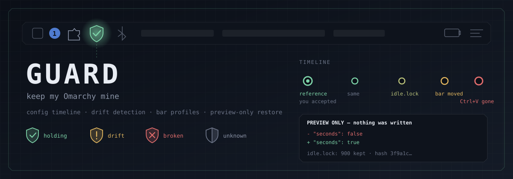
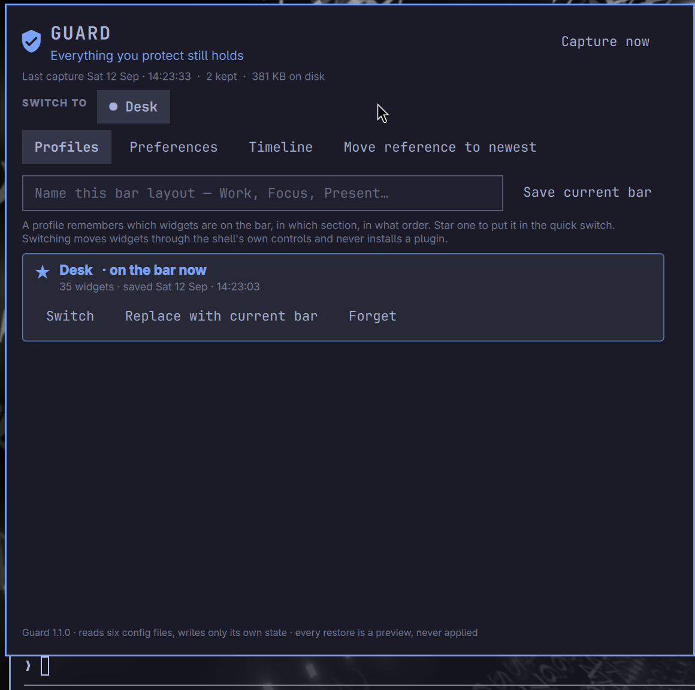
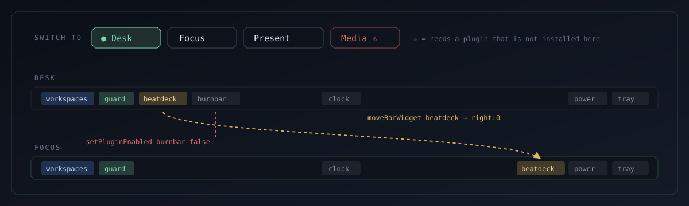
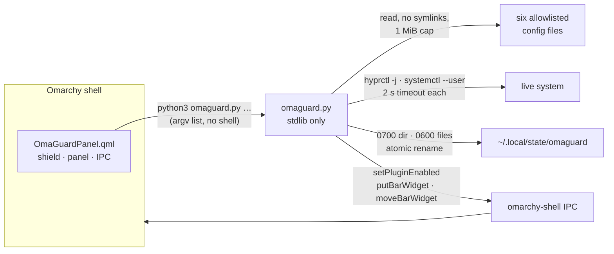

<p align="center">
  
</p>

<p align="center">
  <b>Keep my Omarchy mine.</b><br>
  A shield in the bar that remembers what your desktop used to look like.
</p>

<p align="center">
  
  
  
  
</p>

---

You spend an afternoon getting the bar exactly right. Alt and Super swapped the way your
hands expect. Ctrl+V pasting images into the terminal. Twenty-odd widgets in the order you
chose. Then an update lands, or an agent "helpfully" tidies a config file, or you try
something and forget to undo it — and a week later something feels off and you cannot
say what.

**OmaGuard does two things from the bar:** it keeps your bar layouts one click away, and it
tells you when something you rely on is actually broken — and how to fix it.

## What it looks like

<p align="center">
  
</p>

The shield sits on the left of the bar:

| Shield | Means |
|:---:|---|
| 🟢 | All good — the running desktop confirms nothing is wrong |
| 🔴 **1** | One confirmed problem, and the panel says how to fix it |

The number only ever counts problems the **live desktop** confirms. Editing your bar never
adds one, and a config file OmaGuard cannot read is never counted as a problem.

## Bar layouts: your setups, one click each

<p align="center">
  
</p>

Click the shield and the panel opens on your layouts:

- **Load** switches the bar to a layout. That layout is now *loaded*.
- Change the bar afterwards and the panel says **“Work has unsaved changes”**, lists them in
  plain words (*3 widgets moved: …*), and offers **Save to Work**, **Undo** and **Save as new…**.
- **Save as new…** names the bar as it is now. The new layout becomes the loaded one.
- **Rename** and **Delete** sit on each row. If your bar already matches a saved layout,
  OmaGuard recognises it as loaded.

A layout remembers which widgets are on the bar, in which section, in what order, **and which
are pinned**. Pins matter: bars such as menubar-overload draw each side as zones, and a widget
marked `outer` stays at the corner whatever its position in the list. A layout saved before
OmaGuard recorded pins is labelled, and saving it again fixes it.

Loading is deliberately conservative:

- **It never installs anything.** A layout that needs a missing plugin says so and won't load.
- **It never rewrites `shell.json`.** Each widget is removed, placed, moved or re-pinned through
  the shell's own IPC — `setPluginEnabled`, `putBarWidget`, `moveBarWidget`,
  `setBarWidget … zone` — inside the process that owns the file.
- **It never changes the bar style itself**, and it refuses a bar with duplicate widgets.
- **A failure is never reported as success.** It stops at the first refused step and says which
  widgets moved and which were not attempted.
- **A click is never dropped.** If OmaGuard is busy, your click waits its turn.

## Checks: problems the running desktop confirms

**Details › checks** lists what OmaGuard asks the live system — `hyprctl -j binds / devices /
configerrors` and `systemctl --user` — about what your config files say should be true:

| Check | A problem when |
|---|---|
| Hyprland config | Hyprland reports config errors |
| Clipboard shortcuts | neither Ctrl+C/X/V nor Super+C/X/V is bound, and `clipboard.lua` exists |
| Alt / Super swap | your config swaps them but no live keyboard has the swap |
| Copy on select | the selection-copy service is installed but not running |

Each check is **OK**, **PROBLEM** (with how to fix it), **CAN'T TELL** (OmaGuard could not ask —
never a pass and never a problem) or **NOT USED**. OmaGuard **never executes Lua**, and a text
scan that finds nothing is never a problem: a `clipboard.lua` that builds its binds in a loop
is judged by what Hyprland actually bound.

## History: snapshots, kept until you say otherwise

**Details › history** keeps snapshots of the allowlisted config files OmaGuard reads:

```
~/.config/hypr/hyprland.lua        ~/.config/hypr/looknfeel.lua
~/.config/hypr/bindings.lua        ~/.config/hypr/monitors.lua
~/.config/hypr/input.lua           ~/.config/hypr/autostart.lua
~/.config/omarchy/shell.json
```

`clipboard.lua` and `keyboard-policy.lua` are still watched if they exist. They are not part of current stock Omarchy user config. Packaged clipboard binds live in `/usr/share/omarchy/default/hypr/bindings/clipboard.lua` as Super+C/X/V, not Ctrl+C/X/V.

**Take snapshot** stores one; nothing expires automatically. From a terminal you can compare a
snapshot with another, and `preview` shows putting a single value back — never applied:

```text
PREVIEW ONLY — nothing was written
Bar & plugins  ·  current hash 3f9a1c07b2e4…

-  "seconds": false
+  "seconds": true

Only the one value you picked differs. Everything else in the current file is kept.
```

OmaGuard refuses to preview a whole `shell.json`, a whole section, or an array position
(entries may have moved), because restoring those silently reverts changes you made since.

## Install

OmaGuard needs nothing beyond a stock Omarchy install: `python3` (Omarchy depends on it
through `uwsm` and `kitty`) and the shell's own `omarchy-shell`. No bun, no node, no pip.

```bash
git clone https://github.com/nixfred/omaguard ~/.config/omarchy/plugins/nixfred.omaguard
omarchy-shell shell rescanPlugins
omarchy-shell shell putBarWidget nixfred.omaguard '{"section":"left","index":3}'
```

Or add it from **Settings → Plugins**. If the widget does not appear after a plugin
change, `omarchy restart shell` (never `omarchy refresh shell`, which resets the bar to
defaults).

## Use it from a terminal

Everything the panel does is `omaguard.py`, and every command prints one JSON object:

```bash
cd ~/.config/omarchy/plugins/nixfred.omaguard

python3 omaguard.py layouts                       # layouts, loaded one, unsaved changes, problems
python3 omaguard.py layout-load --id=<layout>     # load a layout
python3 omaguard.py layout-save                   # save the bar into the loaded layout
python3 omaguard.py layout-undo                   # put the bar back to the loaded layout
python3 omaguard.py layout-save-as --name=Focus   # save the bar as a new layout
python3 omaguard.py health                        # the live checks, nothing written

python3 omaguard.py scan                          # take a snapshot
python3 omaguard.py status                        # snapshot history
python3 omaguard.py preview  --id=<snapshot> --file=shell \
                          --path='["plugins","omarchy.clock","seconds"]'
```

Field paths are JSON arrays, not dotted strings: every Omarchy plugin key is itself dotted
(`omarchy.clock`), so a `.` separator could never reach the settings OmaGuard exists to
restore.

The widget has IPC too:

```bash
omarchy-shell nixfred.omaguard toggle
omarchy-shell nixfred.omaguard load Focus
omarchy-shell nixfred.omaguard save
omarchy-shell nixfred.omaguard undo
omarchy-shell nixfred.omaguard status
```

Bind `load Work` and `load Focus` to keys and your layouts are one chord away.

## How it is built



- **The widget owns its data.** There is no `service` entry point. Under a third-party
  bar, `bar.shell.serviceFor()` returns `null` for every plugin — including a widget's own
  service — and nothing logs it. OmaGuard runs its helper directly so it works under any bar.
- **No command strings.** Every subprocess is a fixed argv list; a plugin id or layout
  name is never interpolated into a shell.
- **A silent outage is not allowed to look calm.** A missing `python3` (exit 127), an empty
  reply or a timeout turns the shield red with the reason in the panel.

## Safety limits, stated plainly

- OmaGuard **writes only its own state**: `~/.local/state/omaguard` (0700), files 0600, atomic.
- OmaGuard **never writes desktop config** during capture or preview. Restores are previews.
- Profile switching **does** change the bar — through the shell's supported IPC, one widget
  at a time, and only when you switch a bar layout.
- Captures can include anything you put in those allowlisted files. They stay on this machine;
  OmaGuard makes no network calls.
- A good setup is your choice, not a certification. *Different* is not automatically *wrong*.

## Tests

```bash
./tests/test.sh
```

123 checks against a throwaway `HOME` with a fake `omarchy-shell` on `PATH`, including 300
random layout switches, pins included, that must each land exactly. The suite
fingerprints your real OmaGuard state and `shell.json` before it starts and fails if either
changes.

## Remove OmaGuard

```bash
omarchy plugin disable nixfred.omaguard
rm -rf ~/.config/omarchy/plugins/nixfred.omaguard
rm -rf ~/.local/state/omaguard        # your captures and profiles — only if you want them gone
```

## License

MIT © Fred Nix
