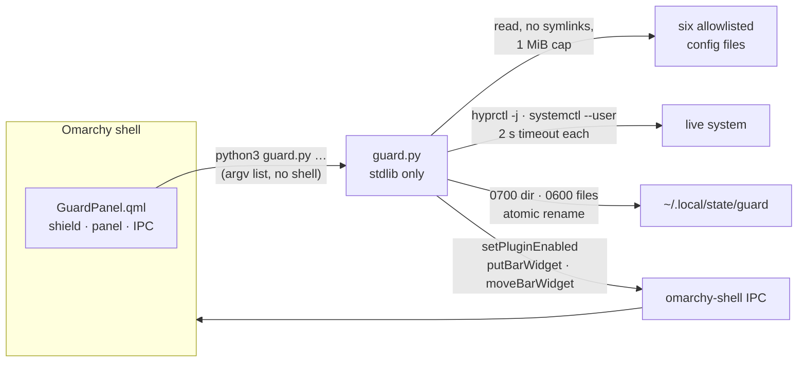

<p align="center">
  
</p>

<p align="center">
  <b>Keep my Omarchy mine.</b><br>
  A shield in the bar that remembers what your desktop used to look like.
</p>

<p align="center">
  
  
  
  
</p>

---

You spend an afternoon getting the bar exactly right. Alt and Super swapped the way your
hands expect. Ctrl+V pasting images into the terminal. Twenty-odd widgets in the order you
chose. Then an update lands, or an agent "helpfully" tidies a config file, or you try
something and forget to undo it — and a week later something feels off and you cannot
say what.

**Guard answers two questions from the bar:** *what changed?* and *does what I chose on
purpose still hold?* And because you rarely want just one bar, it keeps named **profiles**
you can switch between with one click.

## What it looks like

<p align="center">
  
</p>

The shield sits on the left of the bar. Its colour is the verdict:

| Shield | State | Means |
|:---:|---|---|
| 🟢 | **holding** | Every preference you protect still reads the way you left it |
| 🟡 | **drift** | Something changed since the reference you accepted |
| 🔴 | **broken** | A protected preference is gone, or Hyprland is reporting config errors |
| ⚪ | **unknown** | Guard has not been told what "correct" is yet — never shown as a pass |

Click it for three views: **Profiles**, **Preferences** and **Timeline**.

## Profiles: one click between bar layouts

<p align="center">
  
</p>

A profile remembers which widgets are on the bar, in which section, and in what order.
Arrange the bar, type a name — *Work*, *Focus*, *Present* — and press **Save current bar**.
Star it (☆ → ★) and it appears under **SWITCH TO** at the top of the panel.

Switching is deliberately conservative:

- **It never installs anything.** A profile that needs a plugin this machine does not have
  is marked ⚠, names the missing plugin, and refuses to switch.
- **It never rewrites `shell.json`.** Each widget is removed, placed or moved through the
  shell's own IPC — `setPluginEnabled`, `putBarWidget`, `moveBarWidget` — inside the process
  that owns the file. Other tools editing the bar at the same time keep their changes.
- **It never switches the bar plugin itself.** A profile saved under a different bar is
  refused rather than half-applied.
- **A failure is never reported as success.** Guard stops at the first refused step and
  shows exactly which widgets moved and which were not attempted.
- **Renaming keeps identity.** Profiles have stable IDs, so a renamed favourite stays a
  favourite.

## Preferences: evidence, not guesses

Guard reads six files — and only these six:

```
~/.config/hypr/hyprland.lua        ~/.config/hypr/clipboard.lua
~/.config/hypr/bindings.lua        ~/.config/hypr/keyboard-policy.lua
~/.config/hypr/input.lua           ~/.config/omarchy/shell.json
```

…and asks the running system what it is actually doing (`hyprctl -j binds / devices /
configerrors`, `systemctl --user show omarchy-selection-copy.service`). Every check says
where its answer came from:

- **evidence** — Guard read it in a file
- **observed** — Guard asked the live compositor or systemd
- **unknown** — Guard could not tell, and says so

Guard **never executes Lua**. It strips comments lexically and matches exact literals, so
it can tell you `altwin:swap_alt_win` is written in every `kb_options` it found — not what
Hyprland would compute after loading every file. Dynamically built binds are invisible to
a text scan, and Guard's own output says that.

## Timeline: every capture, kept until you say otherwise

Press **Capture now** and Guard stores a snapshot. Nothing expires automatically; storage
used is shown in the panel header, and **Forget** removes one capture on purpose.

A first capture is a *candidate*, not a clean bill of health. You decide which capture is
your **reference** — the state you accept — and Guard measures drift from there.

Open any capture to see what differs from your reference as a unified diff, and preview
putting a single value back:

```text
PREVIEW ONLY — nothing was written
Bar & plugins  ·  current hash 3f9a1c07b2e4…

-  "seconds": false
+  "seconds": true

Only the one value you picked differs. Everything else in the current file is kept.
```

Guard refuses to preview a whole `shell.json`, a whole section, or an array position
(entries may have moved) — because restoring those silently reverts changes you made
since. The hash is the precondition for any manual restore: if the file has changed
since the preview, the preview no longer describes it.

## Install

Guard needs nothing beyond a stock Omarchy install: `python3` (Omarchy depends on it
through `uwsm` and `kitty`) and the shell's own `omarchy-shell`. No bun, no node, no pip.

```bash
git clone https://github.com/nixfred/guard.omarchy ~/.config/omarchy/plugins/nixfred.guard
omarchy-shell shell rescanPlugins
omarchy-shell shell putBarWidget nixfred.guard '{"section":"left","index":3}'
```

Or add it from **Settings → Plugins**. If the widget does not appear after a plugin
change, `omarchy restart shell` (never `omarchy refresh shell`, which resets the bar to
defaults).

## Use it from a terminal

Everything the panel does is `guard.py`, and every command prints one JSON object:

```bash
cd ~/.config/omarchy/plugins/nixfred.guard

python3 guard.py scan                          # capture now
python3 guard.py status                        # timeline, reference, newest capture
python3 guard.py baseline --id=<capture>       # accept a reference
python3 guard.py preview  --id=<capture> --file=shell \
                          --path='["plugins","omarchy.clock","seconds"]'

python3 guard.py profile-save --name=Focus     # save the bar as it is now
python3 guard.py profile-favorite --id=<profile> --value=true
python3 guard.py profile-plan  --id=<profile>  # what a switch would do
python3 guard.py profile-apply --id=<profile>  # do it
```

Field paths are JSON arrays, not dotted strings: every Omarchy plugin key is itself dotted
(`omarchy.clock`), so a `.` separator could never reach the settings Guard exists to
restore.

The widget has IPC too:

```bash
omarchy-shell nixfred.guard toggle
omarchy-shell nixfred.guard scan
omarchy-shell nixfred.guard switchTo Focus
omarchy-shell nixfred.guard status
```

Bind `switchTo` to a key and your profiles are one chord away.

## How it is built



- **The widget owns its data.** There is no `service` entry point. Under a third-party
  bar, `bar.shell.serviceFor()` returns `null` for every plugin — including a widget's own
  service — and nothing logs it. Guard runs its helper directly so it works under any bar.
- **No command strings.** Every subprocess is a fixed argv list; a plugin id or profile
  name is never interpolated into a shell.
- **A silent outage is not allowed to look calm.** A missing `python3` (exit 127), an empty
  reply or a timeout turns the shield red with the reason in the panel.

## Safety limits, stated plainly

- Guard **writes only its own state**: `~/.local/state/guard` (0700), files 0600, atomic.
- Guard **never writes desktop config** during capture or preview. Restores are previews.
- Profile switching **does** change the bar — through the shell's supported IPC, one widget
  at a time, and only when you click a profile.
- Captures can include anything you put in those six files. They stay on this machine;
  Guard makes no network calls.
- A reference is a choice, not a certification. *Different* is not automatically *wrong*.

## Tests

```bash
./tests/test.sh
```

65 checks against a throwaway `HOME` with a fake `omarchy-shell` on `PATH`, including 300
random profile switches that must each land in exact order. The suite
fingerprints your real Guard state and `shell.json` before it starts and fails if either
changes.

## Remove Guard

```bash
omarchy plugin disable nixfred.guard
rm -rf ~/.config/omarchy/plugins/nixfred.guard
rm -rf ~/.local/state/guard        # your captures and profiles — only if you want them gone
```

## License

MIT © Fred Nix
