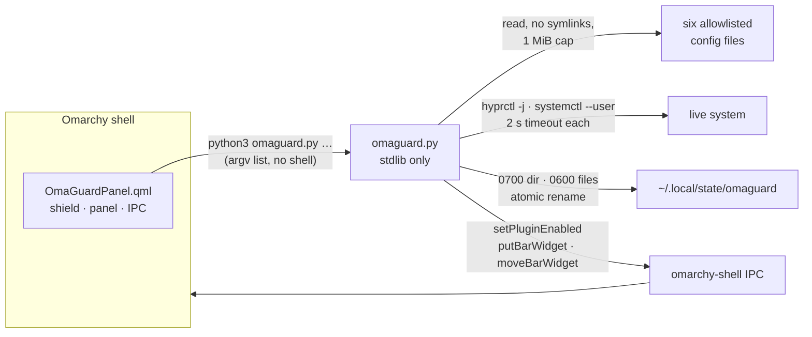

<p align="center">
  
</p>

<p align="center">
  <b>Keep my Omarchy mine.</b><br>
  A shield in the bar that remembers what your desktop used to look like.
</p>

<p align="center">
  
  
  
  
</p>

---

You spend an afternoon getting the bar exactly right. Alt and Super swapped the way your
hands expect. Ctrl+V pasting images into the terminal. Twenty-odd widgets in the order you
chose. Then an update lands, or an agent "helpfully" tidies a config file, or you try
something and forget to undo it — and a week later something feels off and you cannot
say what.

**OmaGuard answers two questions from the bar:** *what changed?* and *does what I chose on
purpose still hold?* And because you rarely want just one bar, it keeps named **bar layouts**
you can switch between with one click.

## What it looks like

<p align="center">
  
</p>

The shield sits on the left of the bar. Its colour is the verdict, and a number beside it
says how many things need your attention:

| Shield | State | Means |
|:---:|---|---|
| 🟢 | **all good** | Nothing changed since you marked your setup good |
| 🟡 | **changed** | Something changed since then — the panel lists what, in plain words |
| 🔴 | **broken** | Something you rely on is gone, or Hyprland is reporting config errors |
| ⚪ | **not set up** | OmaGuard has not been told what "good" looks like yet — never shown as a pass |

Click it and the top of the panel says what happened and offers the obvious next step:

- **Changed** lists each change — *Bar & plugins: 3 widgets moved: omarchy.monitor, …* —
  with **Keep these changes**. One click takes a snapshot, marks it as your good setup,
  and the warning clears. **Show me the details** opens the exact lines.
- **Not set up** offers **This setup is good — remember it**.

Below that are three tabs: **Bar layouts**, **Checks** and **History**.

## Bar layouts: one click between arrangements

<p align="center">
  
</p>

A bar layout remembers which widgets are on the bar, in which section, in what order, **and
which are pinned**. Pins matter: bars such as menubar-overload draw each side as zones, and
a widget marked `outer` stays at the corner whatever its position in the list. A layout
that restored order but not pins would change `shell.json` while the bar looked the same.

Arrange the bar, type a name — *Work*, *Focus*, *Present* — and press **Save my current bar**.
Star it (☆ → ★) and it appears under **SWITCH BAR LAYOUT** at the top of the panel.

Every layout says in words what switching would do before you press anything:

- **✓ This is your bar right now**
- **Switching will move 8 widgets and re-pin 2 widgets**
- **Can't switch: this layout needs plugins that are not installed here: …**
- **Same layout as Desk — you can delete the extras.**
- Layouts saved before OmaGuard 1.3 are flagged: they carry no pin information, so switching
  restores order only. **Update to my current bar** fixes one.

Switching is deliberately conservative:

- **It never installs anything.** A layout that needs a missing plugin names it and refuses.
- **It never rewrites `shell.json`.** Each widget is removed, placed, moved or re-pinned
  through the shell's own IPC — `setPluginEnabled`, `putBarWidget`, `moveBarWidget`,
  `setBarWidget … zone` — inside the process that owns the file.
- **It never changes the bar style itself**, and it refuses a bar with duplicate widgets.
- **A failure is never reported as success.** OmaGuard stops at the first refused step and
  shows exactly which widgets moved and which were not attempted.
- **A click is never dropped.** If OmaGuard is busy reading, the switch waits its turn.
- **Renaming keeps identity.** Layouts have stable IDs, so a renamed favourite stays a
  favourite.

## Checks: evidence, not guesses

OmaGuard reads six files — and only these six:

```
~/.config/hypr/hyprland.lua        ~/.config/hypr/clipboard.lua
~/.config/hypr/bindings.lua        ~/.config/hypr/keyboard-policy.lua
~/.config/hypr/input.lua           ~/.config/omarchy/shell.json
```

…and asks the running system what it is actually doing (`hyprctl -j binds / devices /
configerrors`, `systemctl --user show omarchy-selection-copy.service`). Every check says
where its answer came from:

- **OK** / **CHANGED** / **BROKEN** — from a file OmaGuard read, or from the live compositor
  or systemd
- **CAN'T TELL** — OmaGuard could not check, and says so rather than pass it
- **NOT USED** — nothing on this machine asks for it, so there is nothing to hold

OmaGuard **never executes Lua**. It strips comments lexically and matches exact literals, so
it can tell you `altwin:swap_alt_win` is written in every `kb_options` it found — not what
Hyprland would compute after loading every file. Dynamically built binds are invisible to
a text scan, and OmaGuard's own output says that.

## History: every snapshot, kept until you say otherwise

Press **Take snapshot** and OmaGuard stores a copy of the six files. Nothing expires
automatically; **Delete snapshot** removes one on purpose.

A first snapshot is a *candidate*, not a clean bill of health. You decide which snapshot is
your **good setup**, and the shield measures change from there. Click any snapshot to see how
it differs from your good setup, in plain words first and the exact lines on request.

From the terminal, `preview` shows putting a single value back — never applied:

```text
PREVIEW ONLY — nothing was written
Bar & plugins  ·  current hash 3f9a1c07b2e4…

-  "seconds": false
+  "seconds": true

Only the one value you picked differs. Everything else in the current file is kept.
```

OmaGuard refuses to preview a whole `shell.json`, a whole section, or an array position
(entries may have moved), because restoring those silently reverts changes you made since.

## Install

OmaGuard needs nothing beyond a stock Omarchy install: `python3` (Omarchy depends on it
through `uwsm` and `kitty`) and the shell's own `omarchy-shell`. No bun, no node, no pip.

```bash
git clone https://github.com/nixfred/omaguard ~/.config/omarchy/plugins/nixfred.omaguard
omarchy-shell shell rescanPlugins
omarchy-shell shell putBarWidget nixfred.omaguard '{"section":"left","index":3}'
```

Or add it from **Settings → Plugins**. If the widget does not appear after a plugin
change, `omarchy restart shell` (never `omarchy refresh shell`, which resets the bar to
defaults).

## Use it from a terminal

Everything the panel does is `omaguard.py`, and every command prints one JSON object:

```bash
cd ~/.config/omarchy/plugins/nixfred.omaguard

python3 omaguard.py scan                          # take a snapshot now
python3 omaguard.py status                        # history, good setup, newest snapshot
python3 omaguard.py accept-current                # snapshot now and mark it good
python3 omaguard.py baseline --id=<capture>       # mark an older snapshot good
python3 omaguard.py preview  --id=<capture> --file=shell \
                          --path='["plugins","omarchy.clock","seconds"]'

python3 omaguard.py profile-save --name=Focus     # save the bar as it is now
python3 omaguard.py profile-favorite --id=<profile> --value=true
python3 omaguard.py profile-plan  --id=<profile>  # what a switch would do
python3 omaguard.py profile-apply --id=<profile>  # do it
```

Field paths are JSON arrays, not dotted strings: every Omarchy plugin key is itself dotted
(`omarchy.clock`), so a `.` separator could never reach the settings OmaGuard exists to
restore.

The widget has IPC too:

```bash
omarchy-shell nixfred.omaguard toggle
omarchy-shell nixfred.omaguard scan
omarchy-shell nixfred.omaguard keepChanges
omarchy-shell nixfred.omaguard switchTo Focus
omarchy-shell nixfred.omaguard status
```

Bind `switchTo` to a key and your bar layouts are one chord away.

## How it is built



- **The widget owns its data.** There is no `service` entry point. Under a third-party
  bar, `bar.shell.serviceFor()` returns `null` for every plugin — including a widget's own
  service — and nothing logs it. OmaGuard runs its helper directly so it works under any bar.
- **No command strings.** Every subprocess is a fixed argv list; a plugin id or layout
  name is never interpolated into a shell.
- **A silent outage is not allowed to look calm.** A missing `python3` (exit 127), an empty
  reply or a timeout turns the shield red with the reason in the panel.

## Safety limits, stated plainly

- OmaGuard **writes only its own state**: `~/.local/state/omaguard` (0700), files 0600, atomic.
- OmaGuard **never writes desktop config** during capture or preview. Restores are previews.
- Profile switching **does** change the bar — through the shell's supported IPC, one widget
  at a time, and only when you switch a bar layout.
- Captures can include anything you put in those six files. They stay on this machine;
  OmaGuard makes no network calls.
- A good setup is your choice, not a certification. *Different* is not automatically *wrong*.

## Tests

```bash
./tests/test.sh
```

81 checks against a throwaway `HOME` with a fake `omarchy-shell` on `PATH`, including 300
random layout switches, pins included, that must each land exactly. The suite
fingerprints your real OmaGuard state and `shell.json` before it starts and fails if either
changes.

## Remove OmaGuard

```bash
omarchy plugin disable nixfred.omaguard
rm -rf ~/.config/omarchy/plugins/nixfred.omaguard
rm -rf ~/.local/state/omaguard        # your captures and profiles — only if you want them gone
```

## License

MIT © Fred Nix
